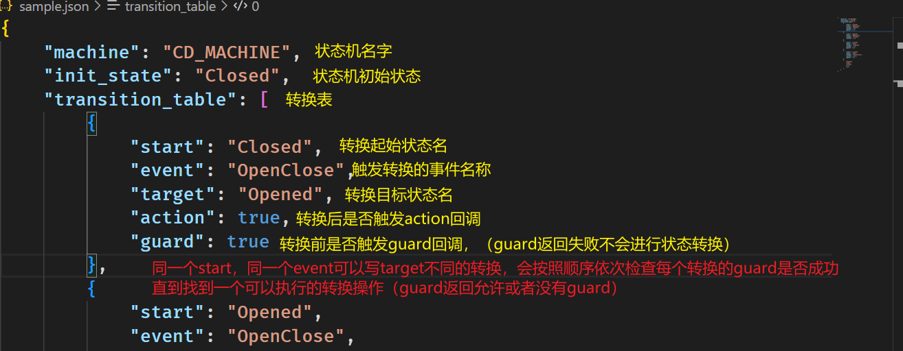
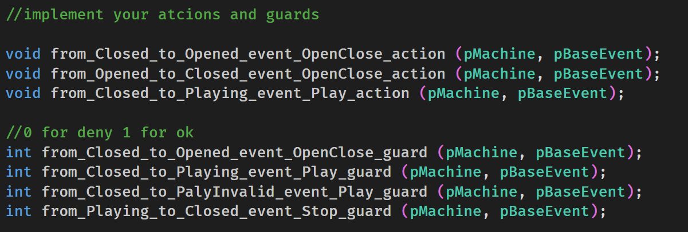

# fsm

## 说明
通过ragel生成状态机的代码，通过每次状态跳转的action实现action和guard
根据json描述的状态机，生成对应的ragel文件，然后由ragel编译为c文件。

## 使用方法

### FSM JSON文件定义
Json 文件示例查看 testjson/sample.json



```shell
python3 main.py your_json_file output_path
ragel xxxx.rl -o xxxx.cpp
```
## C++源文件使用

### 状态机使用

状态机使用示例代码如下

```C++
pMachine m = new_machine();
m->user_data=YourCtx;

pBaseEvent p = new_event(EventTypeEnum);
process(m, p);//触发guard或者action 如果有的话
delete_event(p);

pBaseEvent p2 = new_event(EventTypeEnum);
process(m, p2);
delete_event(p2);

/*
其它事件处理
*/

delete_machine(m);
```

### action和guard

1. 如果用户自定义内存分配函数，请定义USE_USER_MEM_ALLOCATION宏后，提供 usermalloc和user_free函数实现，默认使用malloc和free；
2. 用户自行实现guard和action的实现；


